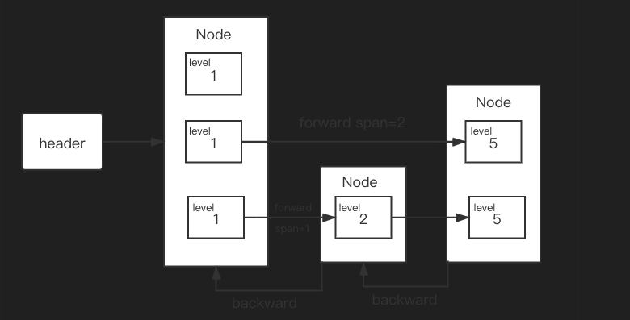

# RediGo

Using golang to achieve Redis

## 一、实现 TCP 服务器

## 二、Redis 通信协议以及协议解析器

### 2.1Redis 通信协议

二进制安全的文本协议 RESF，工作基于 TCP 协议

## 三、实现 KV 内存数据库

KV 内存数据库的核心是并发安全的哈希表

## 四、基础数据结构

### 1.Zset 跳表

数据结构示意图：

实现在：datastruct/zset/sortedset.go 中
