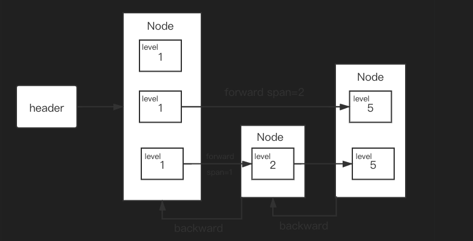

# RediGo

Using golang to achieve Redis

## 一、实现 TCP 服务器

## 二、Redis 通信协议以及协议解析器

### 2.1Redis 通信协议

二进制安全的文本协议 RESF，工作基于 TCP 协议

## 三、实现 KV 内存数据库

KV 内存数据库的核心是并发安全的哈希表

## 四、基础数据结构

### 1.Zset 跳表

数据结构示意图：

实现在：datastruct/zset/sortedset.go 中

### 2. dict

实现在：datastruct/dict/dict.go 中

### 3. Set

实现在：datastruct/set/set.go 中

### 4. String

## 五、pipeline 模式的 redis 客户端

在服务端未响应时客户端继续向服务端发送请求的模式称为 Pipeline 模式。因为减少等待网络传输的时间，Pipeline 模式可以极大的提高吞吐量，减少所需使用的 tcp 链接数。为每一个 tcp 连接分配了一个 goroutine 可以保证先收到的请求先先回复，pipeline 模式的 redis 客户端需要有两个后台协程程负责 tcp 通信，调用方通过 channel 向后台协程发送指令，并阻塞等待直到收到响应，这是一个典型的异步编程模式。
